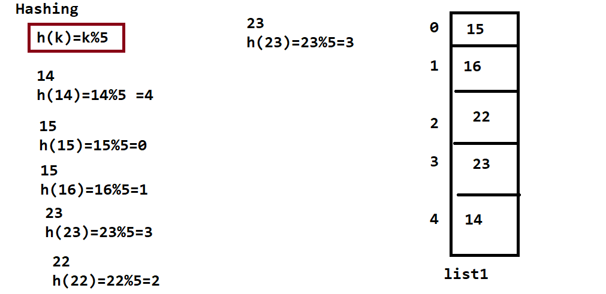
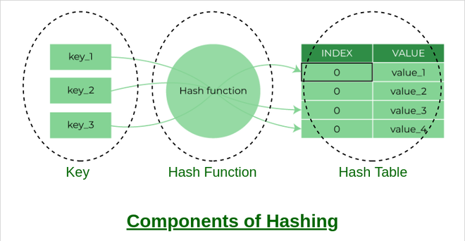
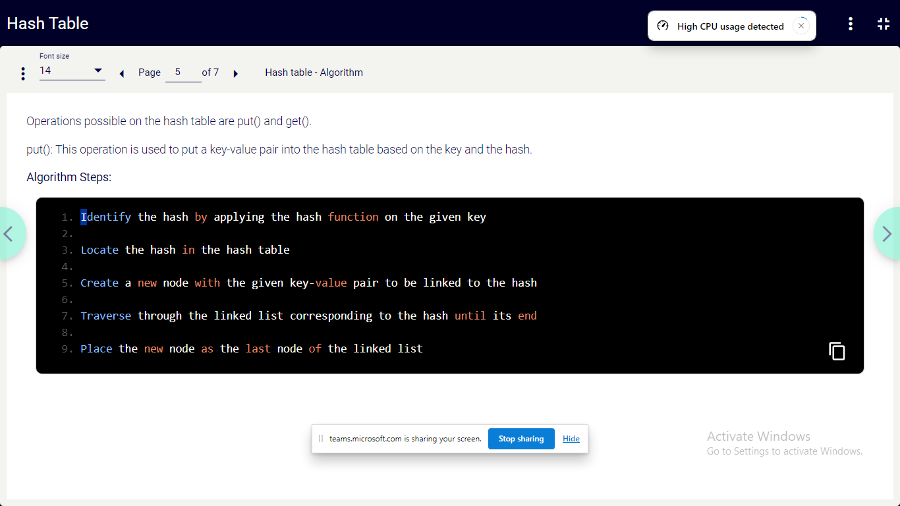
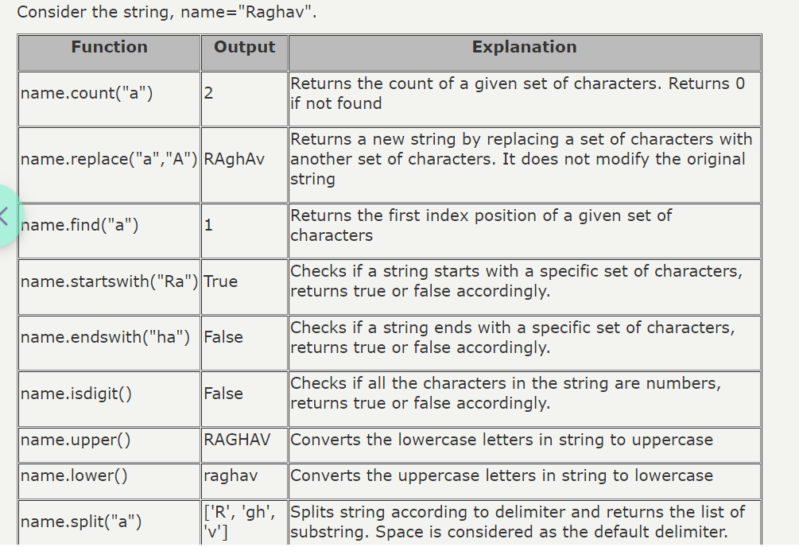

## DAY 04

```
Predict the output of the following code snippet.
result=0
def find_sum(num1,num2):
    if(num1!=num2):
        result=num1+num2
    else:
        result=2*(num1+num2)
find_sum(3,4)
print(result)
find_sum(5,5)
print(result)
a. 0
    0
b. 14
    10
c. 7
   20
d. Error:cannot modify global variable in a program
```

### Hashing function

```
Hashing refers to the process of generating a fixed-size output from an input of variable size using the mathematical formulas known as hash functions. This technique determines an index or location for the storage of an item in a data structure.
```



#### Components of Hashing

There are majorly three components of hashing:

1. Key: A Key can be anything string or integer which is fed as input in the hash function the technique that determines an index or location for storage of an item in a data structure.
2. Hash Function: The hash function receives the input key and returns the index of an element in an array called a hash table. The index is known as the hash index.
3. Hash Table: Hash table is a data structure that maps keys to values using a special function called a hash function. Hash stores the data in an associative manner in an array where each data value has its own unique index.



````
k = 12345
M = 95
h(12345) = 12345 mod 95
               = 90
k = 1276
M = 11
h(1276) = 1276 mod 11
             = 0```
````

```
Que – 1. Given the following input (4322, 1334, 1471, 9679, 1989, 6171, 6173, 4199) and the hash function x mod 10, which of the following statements are true? 
i. 9679, 1989, 4199 hash to the same value 
ii. 1471, 6171 hash to the same value 
iii. All elements hash to the same value 
iv. Each element hashes to a different value 
(A) i only
(B) ii only
(C) i and ii only
(D) iii or iv
```

```
A hash table of length 10 uses open addressing with hash function h(k)=k mod 10, and linear probing. After inserting 6 values into an empty hash table, the table is as shown belowWhich one of the following choices gives a possible order in which the key values could have been inserted in the table? 
(A) 46, 42, 34, 52, 23, 33 
(B) 34, 42, 23, 52, 33, 46 
(C) 46, 34, 42, 23, 52, 33 
(D) 42, 46, 33, 23, 34, 52 
```

```
Q1 of 2outlined_flag
The following values are to be stored in a hash table (arriving in the order shown) using the hash function, h(k)= k%5.  
81, 20, 34, 42, 21, 45
Assume that the hash values are stored in ascending order.
Identify whether collision will occur while mapping the values using the hash function.
Options:
a. Collision will occur at position at 0,1
b. Collision will occur at position 0
c. Collision will occur at position 1
d. Collision will occur at position 3
e. No collision
 
a
b
c
d
e
```
A-Z 65-90
a-z 97-122
<hr>
Hash table - stores data in key value pair


- Algorithm


Linked List

## STRING - (mutable) COLLECTION OF CHARACTERS '',"",'''
### FORMATING
```
a= 10
b= 20
c= 30
print("a =",a,"b =",b,"c =",c)
print("a = {0}, b = {1} c = {2}".format(10,20,30))
print("a = {a}, b = {b} c = {c}".format(a=10,b=20,c=30))
```
OUTPUT
```
a = 10 b = 20 c = 30
a = 10, b = 20 c = 30
a = 10, b = 20 c = 30
```
```
text = "161sdvvdaf"
text2 = "ooo"
#length of the string
print(len(text))

# Concetating
new = text+ text2
print(text)
print(text2)
print(new)

#looping

list = []
for i in range(len(text)):
    list.append(text[i].upper())
print(list)

list = []
for i in text:
    print(i.upper(), end=' ')

num = "01213"
word = "hello"
print(word.count("l"))
print(word.replace("e","E"))
print(word.find("a"))
print(word.endswith("o"))
print(word.startswith("o"))
print(word.isdigit())
print(word.upper())
print(word.lower())
print(word.split("e"))
```


Slicing - [beginindex:endindex:step]

```
name="python"
print(name[0:2])
print(name[:3])
print(name[4:])
print(name[:])
print(name[0:5:2])
print(name[-1:-4:-1])
print(name[-1::-1])
print(name[-1::-1])
s='python'
print('p'in s)          # The OutPut Will be True
print('po' in s)        # The OutPut Will be False
print('py' in s)        # The OutPut Will be True
print('po' not in s)    # The OutPut Will be True
```
<hr>

## Second Half
    - practice session