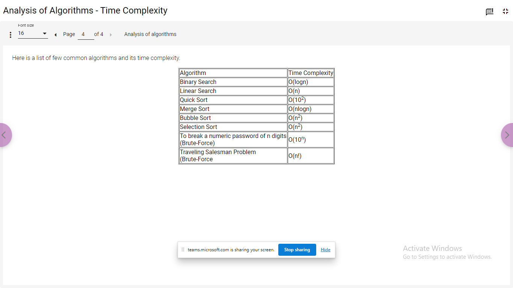
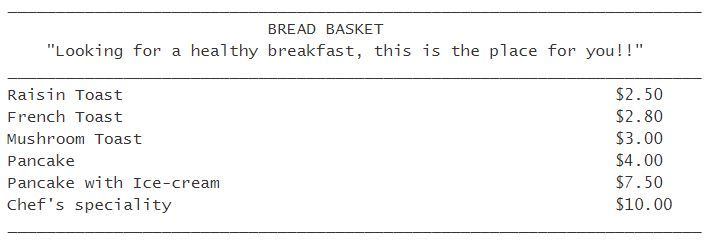

# Day05

Complexity
- Big-O-notation represents max comutation time required

Steps count method provides an estimate of Time Complexity for algo

*
**
***
 
O(1)
O(log n) - 

O(n) linear
O(n logn)
O(n^2) - quadratic

eg [12,34,56,78]  target-12
best case - O(1)  min time and space required
average case - O(2)  expected time and space required 
worst case - O(n) max time and space required


Step Count


<hr>

# DataStructure

## List - Mutable
- storing multiple values in a single list
   index [0,1,2,3,4]   
- list = [1,2,3,5,4]

## Set
## Tuple
## Dictionary

Problem Statement
Let’s see how to create a list in Python and perform some operations on it.
Creating a list:
Creating an empty list
	
sample_list=[]
	
 


Creating a list with known size and known elements
	
sample_list1=["Mark",5,"Jack",9, "Chan",5] sample_list2=["Mark","Jack", "Chan"]
	
List can store both homogeneous and heterogeneous elements


Creating a list with known size and unknown elements
	
sample_list=[None]*5
	
None denotes an unknown value in Python


Length of the list
	
len(sample_list)
	
Displays the number of elements in the list
Random access of elements:
Random read
	
print(sample_list[2])
	
 


Random write
	
sample_list[2]=“James”
	
List is mutable i.e., the above statement will rewrite the existing value at index position 2 with “James”.
Other operations:
Adding an element to the end of the list
	
sample_list.append("James")
	
List need not have a fixed size, it can grow dynamically


Concatenating two lists
	
new_list=["Henry","Tim"] 
sample_list+=new_list
sample_list=sample_list+new_list
	
sample_list+=new_list, concatenates new_list to sample_list
sample_list=sample_list+new_list, creates a new list named sample_list containing the concatenated elements from the original sample_list and new_list 
 
Code in Python 3
 
 
 
#Random write
sample_list[2]="James"
#Random read
print("Element at 2nd index position after random write:",sample_list[2])
#Adding an element to list
sample_list.append("James")
print("After adding element to list:",sample_list)
#Combining two lists
new_list=["Henry","Tim"]
sample_list+=new_list
#Adds Henry and Tim to the existing sample_list
print("After combining two lists - 1st way:",sample_list)
#Another way to combine two lists
sample_list=sample_list+new_list
#Adds Henry and Tim to the new sample_list
print("After combining two lists - 2nd way:",sample_list)
#Accessing an element beyond the total number of elements in the list
print(sample_list[11])
#Will give you IndexError

<hr>

Problem Statement
List data type in Python also have many inbuilt functions.
Consider a list, num_list=[10,20,30,40,50]
Function
	
Output
	
Explanation


num_list.append(60)
	
[10,20,30,40,50,60]
	
Adds an element to end of list


num_list.index(10)
	
0
	
Returns the index position of the element.
In case of multiple occurrence of the element, returns the index of the first occurrence.
Throws ValueError, if the element is not found


num_list.insert(3,60)
	
[10,20,30,60,40,50]
	
Inserts an element at a given position


num_list.pop(3)
	
40
	
Removes and returns the element at given index position from the list


num_list.remove(30)
	
[10,20,40,50]
	
Removes the first occurring element whose value is 30


num_list.sort()
	
[10,20,30,40,50]
	
Sorts the list in ascending order


num_list.reverse()
	
[50,40,30,20,10]
	
Reverses the list
 
Try out the code which uses the List built-in functions and observe the results.
Code in Python 3
mark_list=[78,90,90,95,83,95]
mark_pos=mark_list.index(90)
print("Index position of mark 90:", mark_pos)
mark_list.append(54)
print("After adding new marks:",mark_list)
mark_list.insert(2, 98)
print("After inserting 98 at the 2nd index position:",mark_list)
mark_list.pop(1)
print("After removing the marks at the 1st index position:",mark_list)
mark_list.remove(95)
print("After removing the first occurence of 95 from the list:",mark_list)
mark_list.sort()
print("After sorting the marks in the given list:",mark_list)
mark_list.reverse()
print("After reversing the marks in the given list:",mark_list)
 

    
## slicing

Negative indices can also be used for slicing.
For example: list_of_airlines[-4:-1] will give us the same output as list_of_airlines[1:4]
Try out the below code and observe the result. 
Also, assign the following to new_list and observe the results.
list_of_airlines[1:]
list_of_airlines[:2]
list_of_airlines[:-2]
list_of_airlines[-5:]
Also, try out
list_of_airlines[1:-2]
list_of_airlines[:5]
list_of_airlines[-6:]
list_of_airlines[-6:2]
list_of_airlines[-3:5]


<hr>

list1[3:6]
-100.5
d

6
```
Q1 of 5outlined_flag
Given the list list1 = ["e","d","u","c","a","t","i","o","n"]
What expression will result in the list ["c", "a", "t"] ?
list1[2:5]
list1[3:6] X
list1[5:2]
list1[3:5]

Q2 of 5outlined_flag
What is the output of the following code snippet?
num_list = [100.5,30.465,-1.22,20.15]
num_list.insert(1, -100.5)
num_list.pop(0)
num_list.sort()
print(num_list[0])

100.5
-100.5 X
30.465
Q3 of 5outlined_flag
Which among the following statements may result in an error?
Assume that the statements are executed in the order in which it is written.
a. list1=[5,10,15,20,25]
b. print(len(list1))
c. print(list1[4])
d. print(list1[5]) X
e. print(list1[4:5]) 
f. list1[2]=12
g. print(list1)
h. list1=list1+[8,9]
b
d X
e
h
Q4 of 5outlined_flag
What is the output of the following code snippet?
 
[0, 0, 0, 0, 0]
[10, 20, 30, 40, 50]
[0, 0, 10, 20, 30]
[0, 10, 20, 30, 40]

Q5 of 5outlined_flag
How many comparisons will take place before flag becomes 1?
num_list = [1,33,31,5,26,7,8,92,10]
num = 7
flag = 0
for item in num_list:
   if(item == num):
       flag = 1
   else:
       continue
if(flag == 1):
   print(num, "found in the list")
else:
   print(num, "NOT found in the list")
 
6 X
5
1
9
```
Problem Statement
Write a Python program to generate the next 15 leap years starting from a given year. Populate the leap years into a list and display the list. 

<hr>

Type Casting
Implicit & Explicit
- int
- str
- float

```
Here are two programs implementing the same functionality.
 
Code 1:
	
Code 2:

a=356b=245c=89d=a+c-bprint(d)
 
	
'''This is a program to find thecurrent number of flights in an airport'''landings_count=356takeoffs_count=245initial_flights=89current_flights = initial_flights + landings_count - takeoffs_count#Displaying the current number of flightsprint("Current number of flights:",current_flights)
```




List [] -  mutable, hetro
set {} -  mutable, hetro
tuples () - immutabe , read-only

## Tuples ()

- Operation

```
	
Example
	
Description


Creating a tuple
	
lunch_menu=("Welcome Drink","Veg Starter","Non-Veg Starter","Veg Main Course","Non-Veg Main Course","Dessert")
	
() are optional, a set of values separated by comma is also considered to be a tuple.
sample_tuple="A","B","C"
Although () are optional, it is a good practice to have them for readability of code.
If we need to create a tuple with a single element, then we need to include a comma as shown below:
sample_tuple=("A",)


Random Write
	
lunch_menu[0]=""
	
This will result in an error as tuple is immutable. Hence random write is not possible in tuple.

```

<hr>

## Question - Second HAlf

- Q1
```
Write a python function to add 'ing' at the end of a given string and return the new string. 
If the given string already ends with 'ing' then add 'ly'.
If the length of the given string is less than 3, leave it unchanged.
 
Sample Input
sleep
amazing
is
	
Expected Output
sleeping
amazingly
is

```
- Q2
```
Given a list of numbers, write a python function which returns true if one of the first 4 elements in the list is 9. Otherwise it should return false.
The length of the list can be less than 4 also.
 
Sample Input
[1, 2, 9, 3, 4]
[1, 2, 9]
[1, 2,3,4]
	
Expected Output
True
True
False
```
- Q3
```
Write a python function which accepts a sentence and finds the number of letters and digits in the sentence.
It should return a list in which the first value should be letter count and second value should be digit count. Ignore the spaces or any other special character in the sentence.

Sample Input
Infosys 123
ABCEFG

Expected Output
[7,3]
[6,0]

```
