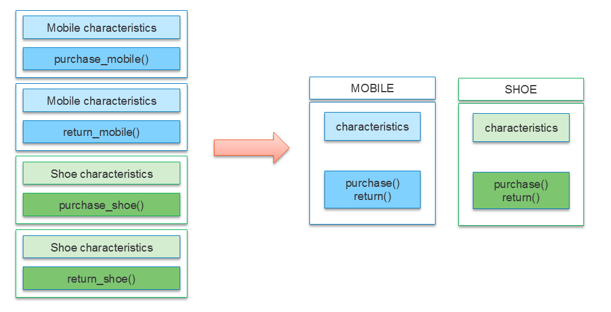
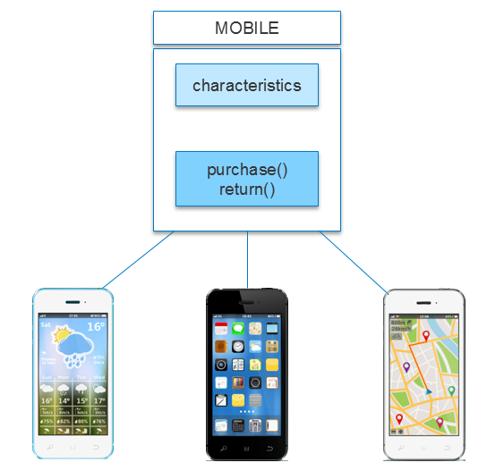
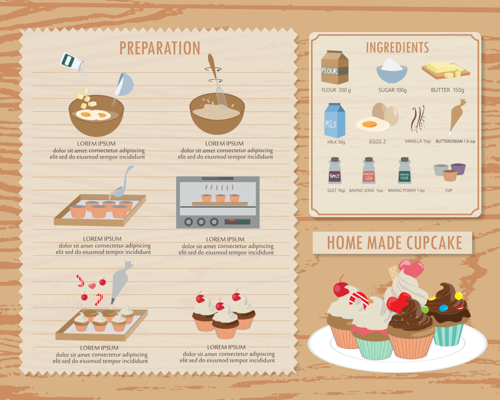
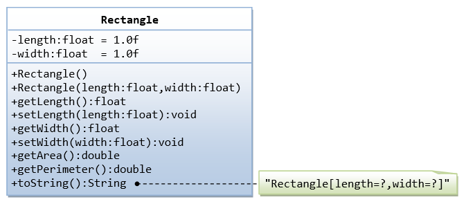
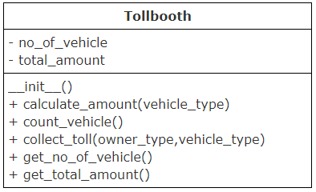
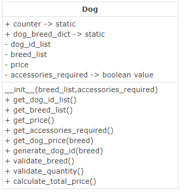
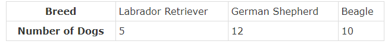

# Day 06

1. Dictionary
- store data in key-value pair
```
sample_dic = {
    key1 : value1,
    key2 : value2,
    key3 : value3
}
```
```
A dictionaries can be used to store an unordered collection of key-value pairs. The key should be unique and can be of any immutable data type. Like lists, dictionaries are mutable. Let’s now understand how a dictionary is implemented in Python.
Creating a dictionary
	
crew_details=
{ "Pilot":"Kumar",
"Co-pilot":"Raghav",
"Head-Strewardess":"Malini",
"Stewardess":"Mala" }
	
First element in every pair is the key and the second element is the value.


Accessing the value using key
	
crew_details["Pilot"]
	
This will return the corresponding value for the specified key


Iterating through the dictionary
	
for key,value in crew_details.items():
     print(key,":",value)
	
items function gives both key and value, which can be used in a for loop.
Dictionary in Python also have many inbuilt functions.
 
Function
	
Output
	
Explanation


crew_details.get("Pilot")
	
Kumar
	
Returns the value for given key. If the given key is not found, returns None


crew_details.update({"Flight Attendant":"Jane", "Co-pilot":"Henry"})
	
No output, dictionary will be updated
	
Updates the dictionary with the given key-value pairs. If a key-value pair is already existing, it will be overwritten, otherwise it will be added to the dictionary
 
 ```
 ```
 #Creating a dictionary
crew_details={
            "Pilot":"Kumar",
            "Co-Pilot":"Raghav",
            "Head-Strewardess":"Malini",
            "Stewardess":"Mala"
}
print(crew_details["Pilot"])
 
print("\nIterating the dictionary using items function")
for key,value in crew_details.items():
    print(key,":",value)
 
 
#Usually while working with dictionary, you will be interested in specific values. 
#Let’s find the value of all pilots from crew_details.
print("\nIterating the dictionary using keyword 'in'")
for key in crew_details:
    if(key=="Pilot" or key=="Co-Pilot"):
        print(crew_details[key])
#Note: Dictionary being unordered, the order of the values being displayed may vary during each execution of the above for loop.
 
#Dictionaries are mutable
crew_details["Pilot"]="James" # Here the value for key "Pilot" is being updated to "James"
print("\nAfter modifying the value of Pilot:", crew_details["Pilot"])
 
print("------------------------------------------------------------------")
print("Before update:")
# Usage of get method()
print("Co-pilot:",crew_details.get("Co-Pilot"))
 
#Usage of update method()
crew_details.update({"Flight Attendant":"Jane", "Co-pilot":"Henry"})
 
print("\nAfter update:")
print("Co-pilot:",crew_details.get("Co-pilot"))
print("Flight Attendant:",crew_details["Flight Attendant"])
 ```
 ```
 Q1 of 2outlined_flag
What is the output of the following code snippet?
sample_dict = {'a':1,'b':2}
sample_dict.update({'b':5, 'c':10 })
print(sample_dict.get('b'), sample_dict.get('c'))
 
5,10 x
2 None
2 10
5 None

Q2 of 2outlined_flag
Assume that a dictionary has data in the form of { key1:value1, key2:value2…}
my_library =
{
    103 : "Alice in Wonderland",
    104 : "The Turning Point",
    113 : "Wings on Fire",
    134 : "Harry Potter"
}
What do you think my_library[104] would point to ?
104 
This is a dictionary and not a list, you cant do that!
The Turning Point  x
There are only 4 elements here, what on earth are you calling index 104 for


Q1. 5,10
Q2. The Turning Point

 ```

 <hr>

# Object

- Objects aree the key to understand object-oriented technology
Characteristic
- state (encapsulates attributes)/info
- behaviour (actions that you can perform)/action/functionality

CLass => is the structure of object(logical model for creating a object)

Object => Physical existence
Class => Logical existence

- Object oriented programming approach allows us to club together the data and behavior so that it becomes easier to code real world scenarios.
Consider the following example, where Mobile and Shoe clubs characteristics as data & purchase(), return() as it's behavior.



- Once we have a template of the data and the related behavior we can use that template to create many copies.


- This style of programming where we create a template and create copies from that template is called object oriented programming. This style allows us to code for scenarios closely linked with real life.
The template we create is called a Class and the copies we create out of it is called an object.



- Objects are real world entities. Anything you can describe in this world is an object. Classes on the other hand are not real. They are just a concept. Class is a short form of Classification. A class is a classification of certain objects and it is just a description of the properties and behavior all objects of that classification should possess.Class is a like a recipe and the object is like the cupcake we bake using it. All cupcakes created from a recipe share similar characteristics like shape, sweetness, etc. But they are all unique as well. One cupcake may have strawberry frosting while another might have vanilla. Similarly, objects of a class share similar characteristics but they differ in their values for those characteristics.


- How many objects can you identify in the below picture?


- How many objects can you identify in the below picture?


A class called Rectangle, which models a rectangle with a length and a width (in float), 
is designed as shown in the following class diagram. 
Write the Rectangle class.



Problem Statement
A toll booth on the way to Bangalore wants to keep the track of the number of vehicles passed through it and total amount collected by them.
Write a python program to implement the class diagram given below.
 
Class description:
Constructor: Initialize both the instance variables, no_of_vehicle, total_amount to 0
count_vehicle(): Increment total number of vehicle by 1
calculate_amount(vehicle_type): Accept vehicle type and identify toll amount for that vehicle based on details given in the table. Add it to the total_amount instance variable.
collect_toll(owner_type,vehicle_type): Accept owner type and vehicle type of the vehicle for which toll should be collected.
If the owner of the vehicle is a "VIP", then toll amount need not be collected but number of vehicles should be updated.
For any other type of owner, calculate the toll amount and update the number of vehicles.
(Hint: Invoke appropriate methods to complete the functionality)
Perform case insensitive string comparison.
Create an object of Tollbooth class, invoke collect_toll() method for different vehicles and test your program.



Problem Statement
Little Puppy Kennel sells dogs of different breeds. They want to automate their selling process.
Write a python program to implement the class diagram given below.

Class Description:
 
dog_breed_dict: Static dictionary which contains the breed of the dog as key and the number of dogs available as value. Initialize it with the sample data given
 
nitialize static variable counter to 100
breed_list: List of dog breeds required by the customer. Initialize it in the constructor
dog_id_list: List of dog ids. Initialize it to an empty list in the constructor
price: Total price to be paid by the customer. Initialize it to 0 in the constructor
accessories_required: Boolean value – True indicated accessories are required and False indicated accessories are not required.                          Initialize it in the constructor
validate_breed(): Return true if all the breeds required by the customer are available. Else return false
validate_quantity(): Return true if one dog/breed is available for all the breeds requested by the customer. Else return false
generate_dog_id(breed): Accept the breed of the dog for which dog id should be generated.                                                                                Auto-generate dog id starting from 101 prefixed by the first character of the breed
get_dog_price(breed): Return the price of the dog whose breed is passed to the method
calculate_total_price(): Calculate the total price of all the dogs required by the customer.
Validate breed and quantity of all the dogs required by the customer
If valid,
For every breed in breed_list,
Update quantity in dog_breed_dict
Auto-generate dog id and append it to attribute, dog_id_list
Add price to attribute, price
If accessories are required, add 350 to attribute, price
If price is more than 1500, provide 5% discount on price
If any breed is not available, return -1
If quantity is not available for any breed, return -2
If quantity is not available for any breed, return -2
 
Breed
	
Price


Labrador Retriever
	
800


German Shepherd
	
1230


Beagle
	
650
 
 