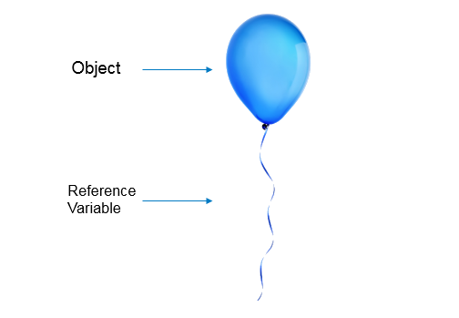
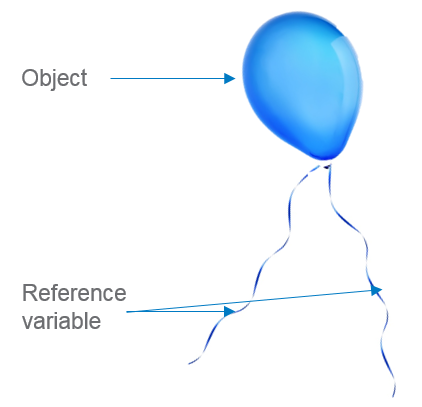

# Day 07

<details>
<summary>
Need for References
</summary>
What happens to a balloon without the ribbon connecting it to the ground? Well, it escapes and becomes unusable.


<details>
<summary>
Understanding References - Try out
</summary>
An object is like a balloon and the reference variable is like the ribbon connecting it to the ground.



```
class Mobile:

    def __init__(self, price, brand):

        self.price = price

        self.brand = brand
 
mob1=Mobile(1000, "Apple")

print(mob1.price)

#We are able to access the object

#in subsequent lines because we

#have a reference variable. This is

```

<details>
<summary>
Object Without a Reference - Try out
</summary>
Just like a balloon without a ribbon, an object without a reference variable cannot be used later.



```
class Mobile:

    def __init__(self, price, brand):

        self.price = price

        self.brand = brand
 
Mobile(1000, "Apple")
```

Multiple References                       Can one balloon have multiple ribbons?
 
Multiple References - Try outProblem Statement
Just like a balloon can have multiple ribbons, an object can also have multiple reference variables. Both the references are referring to the same object. When you assign an already created object to a variable, a new object is not created.
class Mobile:

    def __init__(self, price, brand):

        print ("Inside constructor")

        self.price = price

        self.brand = brand
 
mob1=Mobile(1000, "Apple")

mob2=mob1

print ("Id of object referred by mob1 reference variable is :", id(mob1))

print ("Id of object referred by mob2 reference variable is :", id(mob2))

#mob1 and mob2 are reference variables to the same object
```

Reference variable - Summary                    
Reference variables hold the objects
We can create objects without reference variable as well
An object can have multiple reference variables
Assigning a new reference variable to an existing object does not create a new object


Q1 of 3outlined_flag
Analyze the below code snippet and identify how many objects and reference variables will be there at the end of line 9.
class Table:                 #Line1
    def __init__(self):      #Line2
        self.no_of_legs=4    #Line3
        self.glass_top=None  #Line4
        self.wooden_top=None #Line5
dining_table=Table()         #Line6
back_table=Table()           #Line7
front_table=back_table       #Line8
back_table=dining_table      #Line9
a) 2 Objects, 4 Reference Variables
b) 2 Objects, 3 Reference Variables
c) 4 Objects, 2 Reference Variables
d) 4 Objects, 3 Reference Variables
a
b
c
d
Q2 of 3outlined_flag
Analyze the below code snippet and identify how many reference variables refer to object created in Line 7 at the end of Line 11?
class Table:                  #Line1
    def __init__(self):       #Line2
        self.no_of_legs=4     #Line3
        self.glass_top=None   #Line4
        self.wooden_top=None  #Line5
dining_table=Table()          #Line6
back_table=Table()            #Line7
front_table=back_table        #Line8
back_table=dining_table       #Line9
dining_table=front_table      #Line10
front_table=back_table        #Line11
 
0
1
2
Q3 of 3outlined_flag
Consider the below code snippet:
class Table:                         #Line1
    def __init__(self):              #Line2
        self.no_of_legs=4            #Line3
        self.glass_top=None          #Line4
        self.wooden_top=None         #Line5
    def identify_rate(self):         #Line6
        if(self.glass_top==True):    #Line7
            rate=20000               #Line8
        elif(self.wooden_top==True): #Line9
            rate=30000               #Line10
        else:                        #Line11
            rate=0                   #Line12
        return rate                  #Line13
dining_table=Table()                 #Line14
Which among the following statements placed after line 14 will result in an error?
dining_table.no_of_legs=6
glass_top=True
print (dining_table.rate)


Problem Statement
A vehicle is identified by its mileage (in kms per litre) and fuel left (in litres) in the vehicle. From the fuel left, 5 litres will always be considered as reserve fuel. At any point of time, the driver of the vehicle may want to know:
the maximum distance that can be covered without using the reserve fuel
how many kms he/she has already travelled based on the initial fuel the vehicle had
Identify the class name and attributes so as to represent a vehicle from the information given.
__init__()
Vehicle
Car
identify_disctance_that_can_be_travelled()
mileage
fuel_left
identify_distance_travelled(initial_fuel)
Write a Python program to implement the class chosen with its attributes and methods based on the requirements given below:
identify_distance_that_can_be_travelled(): Return the distance that can be travelled by the vehicle without using the reserve fuel. If the fuel left is less than or equal to reserve fuel, the method should return 0.
identify_distance_travelled(initial_fuel): Return the distance so far travelled by the vehicle based on the initial fuel,fuel left and mileage.
Assume that initial fuel is always greater than fuel left.
Represent a vehicle and test your program by initializing the instance variables and invoking the appropriate methods.


__str__ - Try out                             or a more readable output when printing an object we can use the inbuilt special __str__ method. This method MUST return a string and this string will be used when the object is printed. This is useful in debugging as we can print the values of the attributes.              
```
```
class Shoe:
    def __init__(self,price,material):
        self.price=price
        self.material=material
    def __str__(self):
        print('str is calling')
        return "Shoe with price: " + str(self.price) + " and material: " + self.material
 
#Create an Instance
s1=Shoe(1000,'Canvas')
print(s1)
```

## Private Data Access - Try out         

Problem Statement
We can put a lock on that data by adding a double underscore in front of it, as shown in below code.
Adding a double underscore makes the attribute a private attribute. 
Private attributes are those which are accessible only inside the class. 
This method of restricting access to our data is called encapsulation.

```
class Customer:
    def __init__(self, cust_id, name, age, wallet_balance):
        self.cust_id = cust_id
        self.name = name
        self.age = age
        self.__wallet_balance = wallet_balance
 
    def update_balance(self,amount):
        if amount < 1000 and amount > 0:
            self.wallet_balance += amount
    def show_balance(self):
            print("The balance is ",self.wallet_balance)
 
c1=Customer(100, "Gopal", 24, 1000)
c1.update_balance(500)
c1.show_balance()
print(c1.__wallet_balance)
```

Private Data Update - Caution !    Problem Statement
If we try to assign a value to a private variable, we end up creating a new attribute in python. Thus this code does not give an error, but it is logically flawed and does not produce the intended result.  
```
class Customer:
    def __init__(self, cust_id, name, age, wallet_balance):
        self.cust_id = cust_id
        self.name = name
        self.age = age
        self.__wallet_balance = wallet_balance
 
    def update_balance(self, amount):
        if amount < 1000 and amount > 0:
            self.__wallet_balance += amount
 
    def show_balance(self):
        print ("The balance is ",self.__wallet_balance)
 
c1=Customer(100, "Gopal", 24, 1000)
c1.__wallet_balance = 10000000000
c1.show_balance()
```

## Inheritance

Single Level Inheritance - Try out
 
Problem Statement
Single inheritance enables a derived class to inherit properties and behavior from a single parent class.
Run the below code and observe the output.
 
class Phone:
   def __init__(self, price, brand, camera):
       print ("Inside phone constructor")
       self.__price = price
       self.brand = brand
       self.camera = camera
 
   def buy(self):
       print ("Buying a phone")
 
   def return_phone(self):
       print ("Returning a phone")
 
class SmartPhone(Phone):
   pass
 
SmartPhone(1000,"Apple","13px").buy()
 
 
Multi Level Inheritance - Try out
 
Problem Statement
If a class is derived from another derived class then it is called multilevel inheritance.
Run the below code and observe the output.
class Product:
   def review(self):
       print ("Product customer review")
 
class Phone(Product):
   def __init__(self, price, brand, camera):
       print ("Inside phone constructor")
       self.__price = price
       self.brand = brand
       self.camera = camera
 
   def buy(self):
       print ("Buying a phone")
 
   def return_phone(self):
       print ("Returning a phone")
 
class SmartPhone(Phone):
   pass
 
s=SmartPhone(20000, "Apple", 12)
 
s.buy()
s.review()
 
 
Multiple Inheritance - Try out
 
Problem Statement
If a class is derived from two or more base classes then it is called multiple inheritance.
Run the below code and observe the output.
 
 
class Phone:
   def __init__(self, price, brand, camera):
       print ("Inside phone constructor")
       self.__price = price
       self.brand = brand
       self.camera = camera
 
   def buy(self):
       print ("Buying a phone")
 
   def return_phone(self):
       print ("Returning a phone")
 
class Product:
   def review(self):
       print ("Customer review")
 
class SmartPhone(Phone, Product):
   pass
 
s=SmartPhone(20000, "Apple", 12)
 
s.buy()
s.review()
 
 
 
Multiple Inheritance Contd. - Try out
 
Problem Statement
When a child is inheriting from multiple parents, and if there is a common behavior to be inherited, it inherits the method in Parent class which is first in the list. In our example, the buy() of Product is inherited as it appears first in the list.
 
 
class Phone:
   def __init__(self, price, brand, camera):
       print ("Inside phone constructor")
       self.__price = price
       self.brand = brand
       self.camera = camera
 
   def buy(self):
       print ("Buying a phone")
 
   def return_phone(self):
       print ("Returning a phone")
 
class Product:
   def buy(self):
       print ("Product buy method")
 
class SmartPhone(Phone,Product,):
   pass
 
s=SmartPhone(20000, "Apple", 12)
 
s.buy()
 
 
Hierarchical Inheritance - Try out
 
Problem Statement
When several classes are derived from common base class it is called hierarchical inheritance.
Run the below code and observe the output.
 
 
 
class Phone:
   def __init__(self, price, brand, camera):
       print ("Inside phone constructor")
       self.__price = price
       self.brand = brand
       self.camera = camera
 
   def buy(self):
       print ("Buying a phone")
 
   def return_phone(self):
       print ("Returning a phone")
 
class SmartPhone(Phone):
   pass
 
class FeaturePhone(Phone):
   pass
 
SmartPhone(1000,"Apple","13px").buy()
 

## Method overloading

Encapsulation
Inheritance
Abstraction
Polymorphism