# Day - 09

1. Regular Expression

## Questions

1. What is the output of the below code snippet?
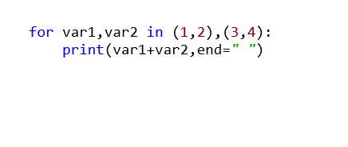
```
4 6
10
3 7 [x]
TypeError
```

2. Find the output of the below Python code.
Note: Assume that necessary imports have been done.
 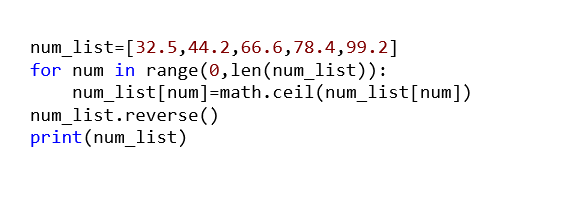
```
[33, 45, 67, 79, 100] [x]
[100, 79, 67, 45, 33]
[33, 44, 67, 78, 99]
[99, 78, 67, 44, 33]
```

3. What is the output of the below code snippet?
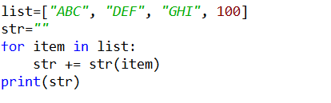
``` 
TypeError
ABCDEFGHI100 [x]
ValueError
ABCDEFGHI
``` 
4. What is the output of the below code snippet?
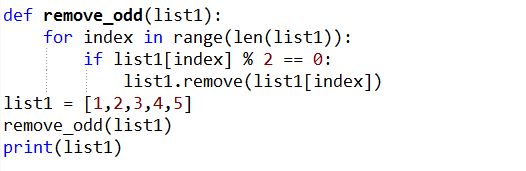
```
[1,3,5]
IndexError [x]
[1,2,4,5]
[1,2,3,4,5]
```

5. What is the output of the below code snippet?
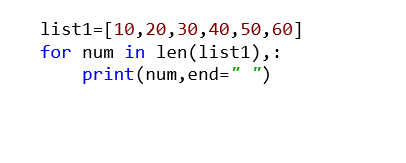
```
6
10 20 30 40 50 60
60
Error [x]
```

6. What is the output of the below code snippet?
 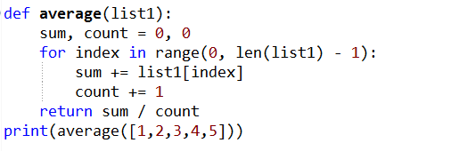
1-1, 3-2, 6-3,10-4,15-5

```
2.5
2
3.0
3 [x]
```
7. What is the output of the below code snippet?
 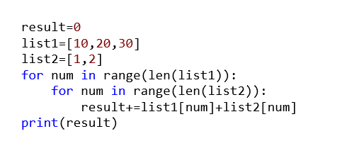

```
22
Error
129
99

```
8. What is the output of the below code snippet?
 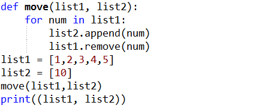
```
([],[10,1,2,3,4,5]) [x]
([1,2,3,4,5],[10])
([2, 4], [10, 1, 3, 5])
ValueError 
```

9. What would be the output of Python code given below?
```
elements=[2,5,6,0]
try:
    div=elements[4]/elements[3]
except ZeroDivisionError:
    print("Infinity")
except IndexError:
    print("Index Error")
except Exception:
    print("0")
finally:
    print("In finally block")
```
- a. Infinity
    In finally block
- b. 0
    In finally block
- c. Index Error
    In finally block
- d. Index Error
 
a
b
c [x]
d

10. What is the output of the below code snippet?
 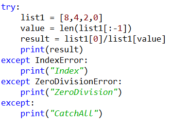
```
ZeroDivision [x]
Index
CatchAll
Index ZeroDivision
```
11. What is the output of the below code snippet?
 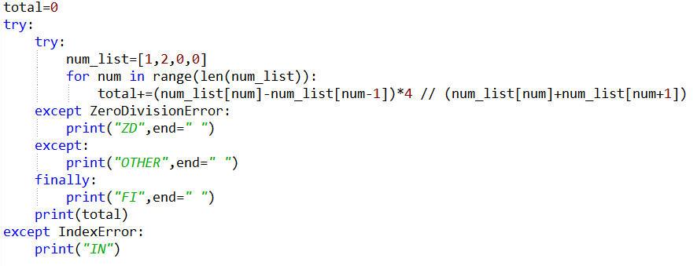
```
ZD FI 3
ZD FI [x]
OTHER FI
OTHER FI 3
```

12. What is the output of the below code snippet?
 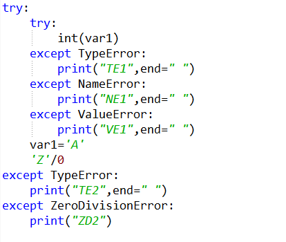

```
TE1 TE2
NE1 TE2 [x]
ZD2
TE2 ZD2
```
Q13 of 15outlined_flag
What is the output of the below code snippet?
 
VE
ZD
CA
VE CA
Q14 of 15outlined_flag
What is the output of the below code snippet?
 
VE
ZD
CA
TE
Q15 of 15outlined_flag
What is the output of the below code snippet?
 
1
2
3
Error

## Question 2

1. Which of the following strings will match the regular expression given below?

```
Hello (World|Program) .?

Hello World !
Hello Program !!!!
Hello World!
Hello Program
Hello World Program
Hello Program

Sol -
Hello World !
Hello World!
Hello Program
Hello World Program
``` 

Anything you have in parentheses () will be a capture group. using the group(group_number) method of the regex Match object we can extract the matching value of each group.


## Regex Capturing Groups
1. Python Regex Capturing Groups
 
- Anything you have in parentheses () will be a capture group. using the group(group_number) method of the regex Match object we can extract the matching value of each group.
- We will see how to capture single as well as multiple groups.
- Example to Capture Multiple Groups

Let’s assume you have the following string:

```
target_string = "The price of PINEAPPLE ice cream is 20"
```
And, you wanted to match the following two regex groups inside a string
- To match an UPPERCASE word
- To match a number
- To extract the uppercase word and number from the target string we must first write two regular expression patterns.
1. Pattern to match the uppercase word (PINEAPPLE) "[A-Z]"
2. Pattern to match the number (20). "\d"

The first group pattern to search for an uppercase word: [A-Z]+
[A-Z] is the character class. It means match any letter from the capital A to capital Z in uppercase exclusively.
Then the + metacharacter indicates 1 or more occurrence of an uppercase letter
Second group pattern to search for the price: \d+
The \d means match any digit from 0 to 9 in a target string
Then the + metacharacter indicates number can contain a minimum of 1 or maximum any number of digits.
Extract matched group values
In the end, we can use the groups() and group() method of match object to get the matched values.
 
Now Let’s move to the example.
Example
import re
target_string = "The price of PINEAPPLE ice cream is 20"# two groups enclosed in separate ( and ) 
```
bracketresult = re.search(r"(\b[A-Z]+\b).+(\b\d+)", target_string)
```
 Extract matching values of all groupsprint(result.groups())# Output ('PINEAPPLE', '20')# Extract match value of group 1print(result.group(1))# Output 'PINEAPPLE'# Extract match value of group 2print(result.group(2))# Output 20


## Module

- Code organization is done through modules and packages!
- A module is nothing but a normal python file with a .py extension.
- A package is just a normal folder which contains an empty file who’s name is __init__.py. Since package is a folder it can store many python modules/files in it.
 

- Let's assume that the ManageFlights.py inside Flights package has the below code:
airline="Smart Airlines"def add(no_of_flights):    print(no_of_flights," flights added to the fleet")
If we need to access the function add(), inside the ManageFlights module in some other module, then we can import the ManageFlights module and use it.
Import can be done in two ways:
Method 1:
from Flights import ManageFlights #from packagename import modulenameManageFlights.add(10)
Method 2:
import Flights.ManageFlights #import packagename.modulenameFlights.ManageFlights.add(10)

<hr>

Q1 of 2outlined_flag
1. Following is the code snippet from an airline application, which displays the number of passengers travelling in a particular airline.
Fill in the blanks to complete the functionality.
Choose TWO CORRECT options.
ticket_data.py
ticket_list = ["AI567", "AI077", "BA896", "SI267", "AI077", "SI267","AI567"]
def get_ticket_data():  #function to return the ticket_list
    return ticket_list
    
logic.py
(1)____________________________
def find_passengers_flight(airline_name):
    # get the ticket list using get_ticket_data function from ticket_data.py module
    ticket_list = (2)_____________________
    count=0
    for ticket in ticket_list:
        if(ticket.startswith(airline_name)):
            count+=1
    return count
menu.py
(3)__________________________________________
airline_name = input("Enter airline name : ")
no_of_passengers = find_passengers_flight(airline_name)
print("No of passengers in ", airline_name, ":", no_of_passengers )
 
1- from ticket_data import get_ticket_data 2 - get_ticket_data() 3 - from logic import find_passengers_flight
1- from ticket_data import get_ticket_data 2 - get_ticket_data() 3 - import logic
1- import ticket_data 2 - ticket_data.get_ticket_data() 3 - from logic import find_passengers_flight
1- import ticket_data 2 - get_ticket_data() 3 - from logic import find_passengers_flight
Q2 of 2outlined_flag
Consider an application with the file structure as shown below :
Which of the following statements are correct to import function_1 from Data.loader.py into UserInterface.menu.py ?
Choose TWO CORRECT options.
from Data.loader import function_1 as loader_function1
from Data.loader import function_1 as function_1
from Data.loader import function1
from Data.loader import function_1 as new_function