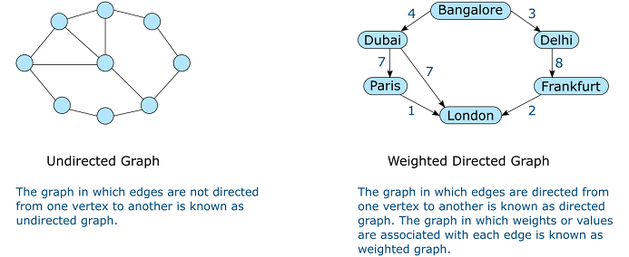
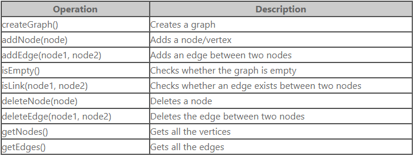
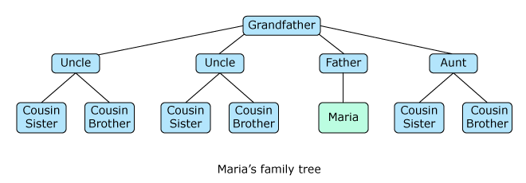
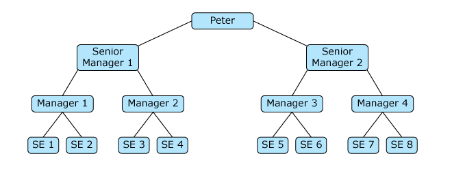
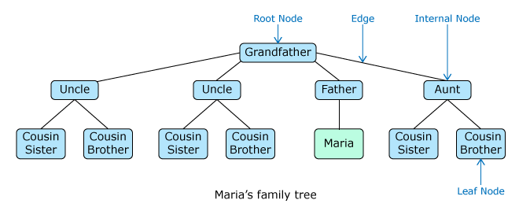
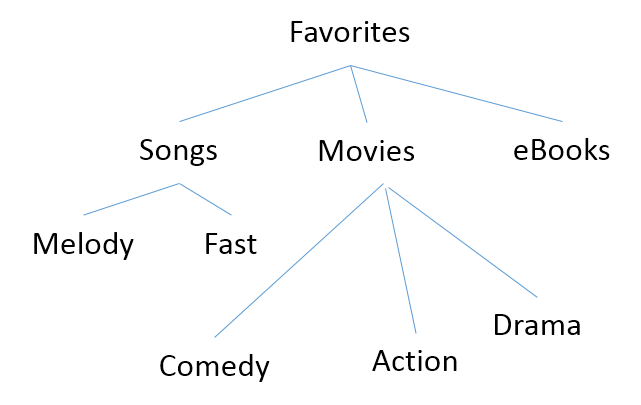

## Non-Linear Data Structure 
- where we need to arrange data in form of vertices and edges

## Graphs
- A Graph is a non-linear data structure that consists of vertices (nodes) and edges.
1. Undirected graph
2. Directed graph

-  Scenario-1:
The network engineers of a company are trying to connect all the computers (numbered 1 to 9) in the company network. They also need to provide a path to traverse from one computer to the other.
- Scenario-2: 

Maria is planning a vacation trip to Europe and is trying to choose the best air route from the available options based on the travel time in hrs.
Option-1: Bangalore(4hrs) -> Dubai(7hrs)-> Paris(1hr)-> London
Option-2: Bangalore(3hrs)->Delhi(8hrs)->Frankfurt(2hrs)->London
Option-3: Bangalore(4hrs)->Dubai(7hrs)->London

## Tree
- Scenario-1:
Maria is preparing her family tree. She has her grandfather as the head of the family. Her grandfather has three sons and one daughter. Her aunt and uncles have one son and one daughter each. Maria is the only child of her father.
- Scenario-2: 
Peter who has become the head of his team is preparing the organization structure. He has two senior managers reporting into him. To each of the senior managers, there are two managers reporting and to each of the managers, there are again two software engineers reporting.                                  - - Scenario-1: Family Tree  
                      
- Scenario-2: Organization Structure     

This type of non-linear arrangement where a node is attached to one or more nodes directly beneath it, is a special type of graph known as tree. In this data structure, the top most node is called the root and the connections between nodes are called edges. Nodes that have no children are called leaf nodes and non-root and non-leaf nodes are called internal nodes.                                    

Trees are used extensively in searching and sorting applications.
 

 ## Questions

1. A travel agent plans trips for tourists from Chicago to Miami. He gives them three ways to get from town to town: airplane, bus, train.
Once the tourists arrive, there are two ways to get to the hotel: hotel van or taxi. The cost of each type of transportation is given in the table below.
Which data structure can be used to represent all the possible ways to go from Chicago to Miami?
 Transportation Type	Cost
  Airplane	  $ 350
  Bus	  $ 150
  Train	  $ 225
  Hotel Van	  $ 60
  Taxi	  $ 40
 
- Tree 
- Graph [x]
- Queue
- Stack

2. In an ATM, a customer can get a mini statement of his/her last 5 transactions.
Which is the most appropriate data structure to model the mini statement?
- List
- Queue
- Stack [x]
- Graph

3. Which is the most appropriate data structure to model the token for cash withdrawal in a bank?
1st token is provided to the first person who has arrived to withdraw money. The next person is provided the 2nd token etc. The person who got the first token will be serviced first.
- List
- Queue [x]
- Stack
- Graph

4. Mary wants to model all the items in a retail store under various categories and sub-categories.
Which of the below data structures can be used to optimally represent it?
- Tree [x]
- List
- Queue
- Stack
- Graph